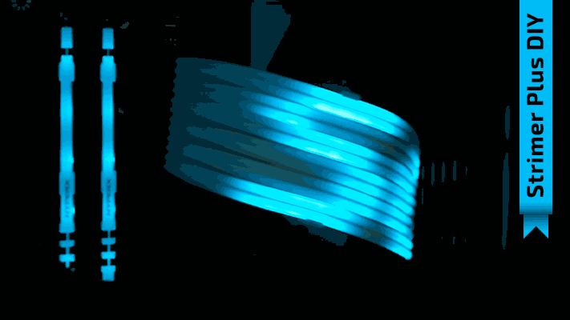
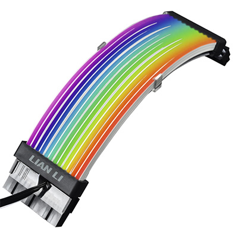
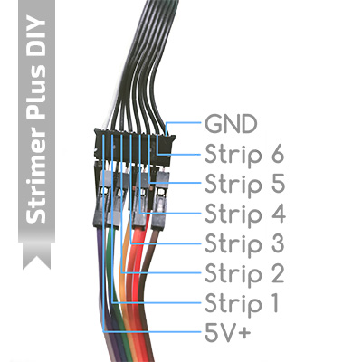
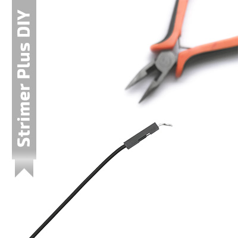
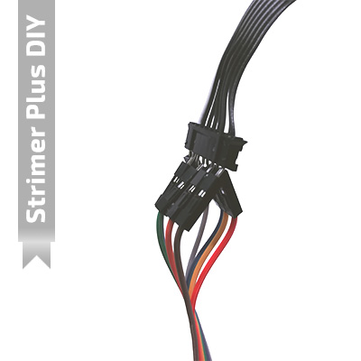

# Strimer Plus Arduino

**Version:** 2021.10.27

**Author:** Murat TAMCI

**Web Site:** www.themt.co

**Note:** In loving memory of my grandfather (Ahmet Ozdil)

## Welcome to Strimer Plus Arduino

Strimer Plus Arduino is an **Arduino project**. It makes cool and different the Strimer Plus product of **Lian-Li** corporation with **displaying scrolling text message**.

[Click here](https://lian-li.com/product/strimer-2-24pin/) to show official Official Strimer Plus product.

Arduino connected to the Strimer Plus with jumper wires. Sketch (code) with Arduino drives to all leds on Strimer Plus. Putty application sends commands to sketch in Arduino for change something inside. That is all flow.

IMPORTANT NOTE: Remove "-master" suffix from folder name and make it just "Strimer_Plus_Arduino". Because folder's name must be same with ino extended file for Arduino IDE.

## Getting Started

Connect the 8 lines Strimer Plus cable to Arduino with guide by "**Pinout**" section.

Upload the sketch to Arduino named "**Strimer_Plus_Arduino.ino**".

Double click to the "**putty session.reg**" file on Windows and register it. That adds the "**StrimerPlusArduino**" option into session of **Putty**.

Run "**Putty.exe**" and select "**StrimerPlusArduino**" and click **Load** button. Write com port of Arduino to **Serial line** edit box. Click the **Open** button. It opens Terminal for writing commands.

Write some command with guide by "**Commands**" section. For example:

`-msg Hello word -color ff0000 -save 1`

Above command tells us.  Displayed message will be "**Hello word**". Color will be "**Red**" and these settings will save into Arduino EEPROM. If we use `save` command then settings will reload when Arudino power on.

Commands
--------

- `-msg text message`: Change the scrolling text message.
- `-inv 1 or 0`: Invert status. exchange color between background color.
- `-delay 35`: Scrolling delay. lower value is faster scrolling. higher value is slower.
- `-bri 0...255`: Brightness value. range is 0-255. 0 = dark. 255 = brighter.
- `-color C8FF00`: Change foreground color with formatted hex.
- `-bgcolor 000000`: Change background color with formatted hex.
- `-reset 1`: Reset to Arduino.
- `-save 1`: Save settings into Arduino.

Pinout
------

Arduino 5V+			->	White line (WL)

Arduino PIN 03		->	WL + 1

Arduino PIN 05 	->	WL + 2

Arduino PIN 06 	->	WL + 3

Arduino PIN 09 	->	WL + 4

Arduino PIN 10 	->	WL + 5

Arduino PIN 11 	->	WL + 6

Arduino GND		->	WL + 7

Requirements
------------

- 1x	Arduino Micro for work.
- 1x	USB cable for communication.
- 8x	Jumper wire for connect Arduino to Strimer Plus.
